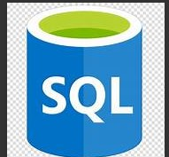
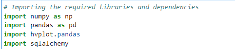
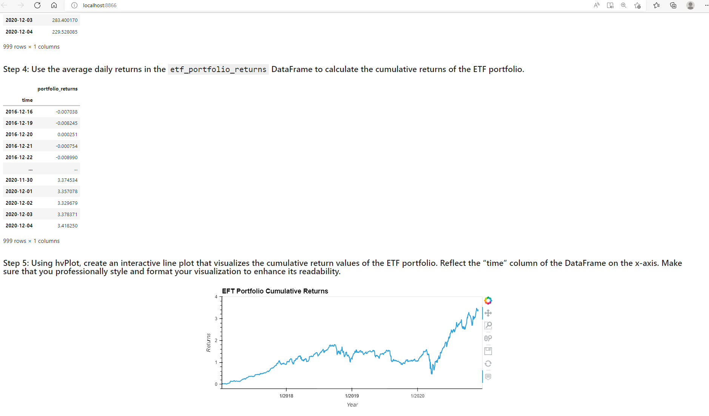

# Challenge_7_ETF_Analysis_using_SQL
This challenge was to showcase our newly acquired SQL skills by creating, analyzing a financial database  and creating a web application from the Jupyter notebook for a fintech ETF.

>

---
## Technologies
The programming language used for this analysis was **Python (v 3.9.7)**.

The applicable libraries needed to run this analysis are:
>

---
## Installation Guide 
All of the above libraries should be part of the base applications that were installed with the Python version above; if not you will have to install them trhough the pip package manager of Python.

---

## Contributor

James Handral
james.handral@gmail.com

---
## License 

N/A

---
## Challenge Summary 

1) Connected a local DataBase, which contained a EFT's indvidual stocks information with my Jupyter notebook for my analysis.
2) Analzyed a single asset in the EFT by using my SQL skills to pull individual stock info into a jupyter dataframe for my analysis.
3) Joined each individual stocks (database tables) in the EFT database into one dataframe in the jupyter notebook to analyze the EFT portolio utilzing the inner JOIN function with SQL.
4) I finally deployed the notebook as a web application utilizing the voila library, see screen shot below of web application deployed.

  >

  **link to Jupyter notebook**

  [etf_analyzer2](./Starter_Code%20(8)/Starter_Code/etf_analyzer2.ipynb)

